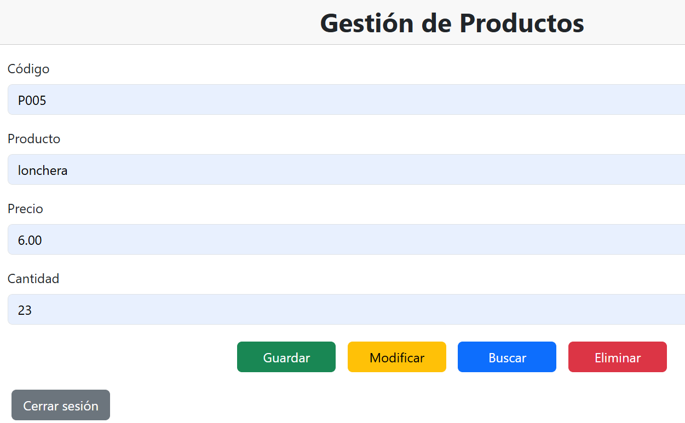
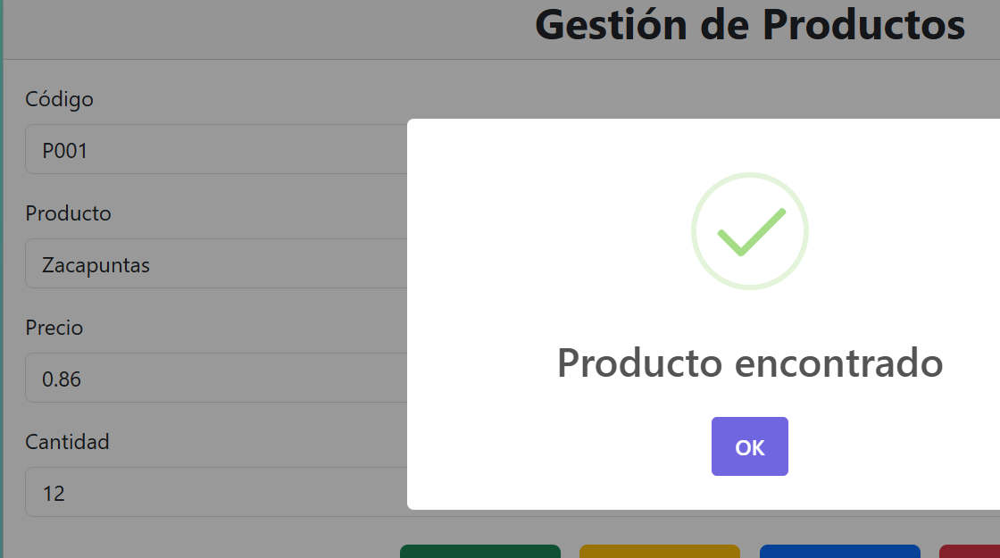
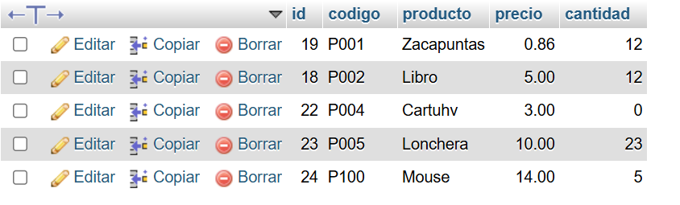
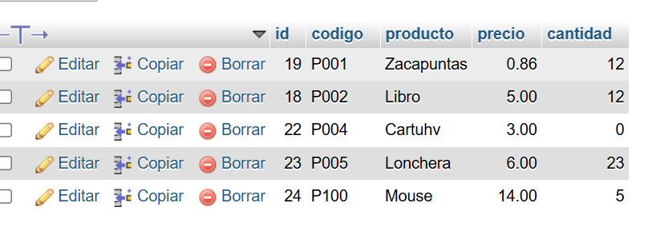
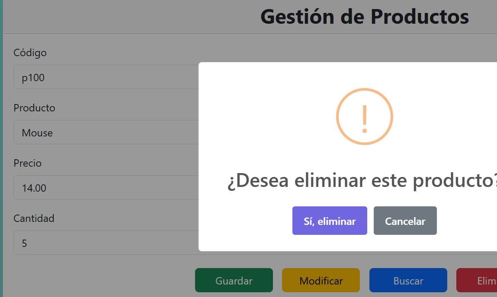

# Laboratorio: CRUD – API Fetch y MySQL con 
# Integración con Seguridad en APIs con JWT


## Descripción

JWT_API_MAIN es una aplicación web desarrollada en PHP y MySQL que implementa un
CRUD de productos mediante una API REST protegida con autenticación JWT (JSON Web Token).

El sistema permite:

* Iniciar sesión mediante usuario y contraseña.
* Generar un token JWT.
* Crear productos.
* Buscar productos.
* Actualizar productos.
* Eliminar productos.
* Proteger las rutas de la API mediante autenticación.

---

## Integrantes

* Kathlyn Morales
* Maryennis Deans
  
---

##  Tecnologías utilizadas

* PHP 8
* MySQL
* JavaScript
* Fetch API
* Bootstrap
* SweetAlert2
* JWT (firebase/php-jwt)
* Composer
* WAMP
* Postman

---

## Estructura del proyecto

```text
JWT_API_MAIN/

│ login.php
│ seguridad.php
├── api/
│   └── products.php

├── config/
│   ├── config.php
│   └── Conexion.php

├── controllers/
│   ├── GuardarProductoController.php
│   ├── BuscarProductoController.php
│   ├── EditarProductoController.php
│   └── EliminarProductoController.php

├── models/
│   ├── GuardarProducto.php
│   ├── BuscarProducto.php
│   ├── EditarProducto.php
│   └── EliminarProducto.php

├── utilities/
│   ├── SanitizarEntrada.php
│   ├── Validaciones.php
│   └── ValidarForm.php

├── views/
│   ├── login.html
│   └── productos.html

├── js/
│   ├── login.js
│   └── producto.js

├── css/
│   └── estilos.css

└── vendor/
```

---

## Base de datos

En MysqlMyadmin, creamos la base de datos: productosdb

### Tabla productos

La Tabla productos almacena la información correspondiente a cada producto registrado en
el sistema.

```sql
CREATE TABLE productos(

id INT AUTO_INCREMENT PRIMARY KEY,

codigo VARCHAR(20) NOT NULL,

producto VARCHAR(100) NOT NULL,

precio DECIMAL(10,2) NOT NULL,

cantidad INT NOT NULL

);
```

### Tabla usuarios
La tabla usuarios almacena las credenciales necesarias para el inicio de sesión

```sql
CREATE TABLE usuarios(

id INT AUTO_INCREMENT PRIMARY KEY,

usuario VARCHAR(50) NOT NULL,

clave VARCHAR(255) NOT NULL

);
```

---

## Usuario administrador

La contraseña se almaceno cifrada con crear_hash.php y luego se inserto en la base de datos:

```php
password_hash(
    "escribe la contraseña",
    PASSWORD_BCRYPT
);
```

---

## Instalación del proyecto

### 1. Clonar el repositorio

```bash
git clone https://github.com/Kathlyn71/CRUD-API-Fetch-y-MySQL-con-Integraci-n-con-Seguridad-en-APIs-con-JWT
```

---

### 2. Abrir WAMP

Iniciar:

* PhpMyadmin

Colocar el proyecto dentro de la carpeta Wamp64/www

---

### 3. Instalar dependencias

Abrir la terminal en la carpeta del proyecto y ejecutar:

```bash
composer install
```

para generar la carpeta vendor

```

descargar la librería:

```text
composer require firebase/php-jwt
```

---

## Inicio de sesión

El sistema verifica el usuario, valida la contraseña con password_verify(), se genera el token JWT
guarda el token en localStorage y redirige al módulo de productos.

---

## Seguridad JWT

Cada petición protegida envía:

```text
Authorization: Bearer TOKEN
```

El archivo: seguridad.php

Se encarga de:

* Obtener el token.
* Verificar la firma.
* Verificar expiración.
* Validar autenticación.
* Denegar acceso si el token es inválido.

---

## Endpoints de la API
El sistema implementa un CRUD (Create, Read, Update y Delete) para la gestión de productos
mediante una API REST desarrollada en PHP orientado a objetos.
Las operaciones implementadas son:

### Crear producto
Permite registrar un nuevo producto enviando los siguientes datos: Código, Nombre del producto,
Precio y Cantidad



Antes de guardar se realizan validaciones como: Campos obligatorios, El precio no puede ser negativo.
La cantidad no puede ser negativa. No se permiten productos repetidos por código o nombre.

---

### Buscar producto

Permite: Buscar un producto por su código, obtener el listado completo de productos.




---

### Actualizar producto

Permite actualizar el Nombre del producto, Precio y Cantidad.

Se validan nuevamente los datos antes de realizar la actualización.

Producto actualizado y se verifico en la base de datos, el producto
lonchera se actualizo el precio





---

### Eliminar producto

Permite eliminar un producto enviando únicamente el código del producto y se utiliza confirmación
desde la interfaz mediante SweetAlert2.



---

## Validaciones implementadas

### Cliente

* Campos obligatorios.
* Precio mayor o igual a cero.
* Cantidad mayor o igual a cero.
* Confirmación antes de eliminar.

### Servidor

* JSON válido.
* Campos obligatorios.
* Producto repetido.
* Precio negativo.
* Cantidad negativa.
* Usuario inexistente.
* Contraseña incorrecta.
* Token inválido.
* Token expirado.

---

## API REST

La API fue desarrollada siguiendo una arquitectura por capas:

Controllers
↓
Models
↓
Conexion
↓
MySQL

Se implementó un enrutamiento centralizado mediante la instrucción:

```bash
switch($_SERVER["REQUEST_METHOD"])
```

Los métodos soportados son:

| Método | Acción                  |
| ------ | ----------------------- |
| POST   | Crear producto          |
| GET    | Buscar/Listar productos |
| PUT    | Actualizar producto     |
| DELETE | Eliminar producto       |

Todos los servicios devuelven respuestas JSON con la estructura:

---
